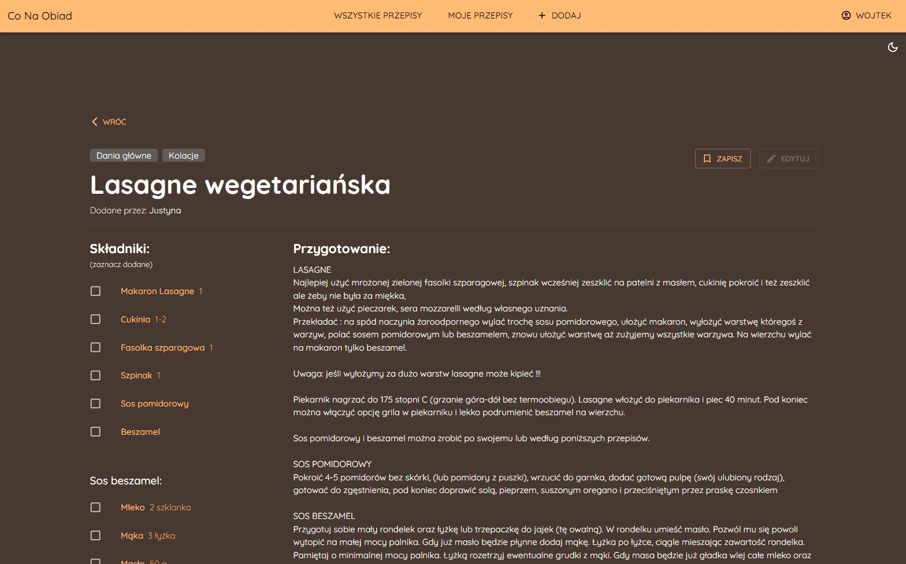
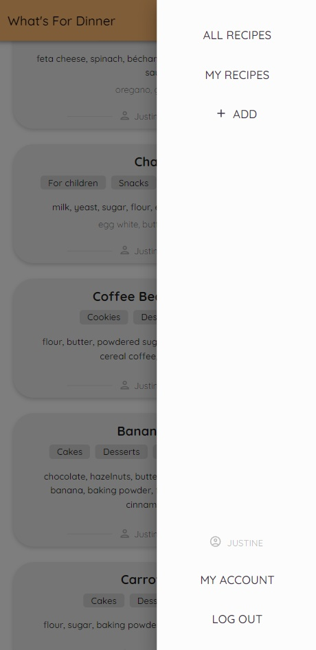

# Co na Obiad

**"Co na Obiad"** (*"What's for Dinner"*) is a dynamic web application designed to assist users in discovering, sharing,
and managing recipes.
Utilizing the **MERN** stack (MongoDB, Express.js, React, and Node.js) this application offers a robust and interactive
platform for culinary enthusiasts.

**It's online!** Check it out at [conaobiad.onrender.com](https://conaobiad.onrender.com/)

## Overview

The application serves as a comprehensive recipe resource where users can explore a diverse array of recipes, each
tailored to different tastes and occasions. With the ability to filter recipes by ingredients, categories, and even save
them for future reference, users can easily find and organize their favorite dishes. Additionally, the platform supports
user-generated content, allowing individuals to contribute their own recipes and engage with others through comments.

## Features

- **Recipe Discovery and Filtering:** Users can search for recipes based on ingredients and categories, ensuring they
  find exactly what they need. You can also save your favorite recipes for easy access later.
  This functionality also allows users to exclude ingredients they dislike or are allergic to.
- **User Contributions:** After logging in, users can add their own recipes to the platform, sharing their culinary
  creations with the community.
- **Community Interaction:** Users can comment on recipes, providing feedback, tips, or simply sharing their thoughts on
  the dishes.

## Technical Stack

- **Frontend:** React, and Material-UI (MUI)
- **Backend:** Node.js, Express.js, Vite
- **Database:** MongoDB

## Security

- **JSON Web Tokens (JWT):** Implemented to manage user authentication securely.
- **Google reCAPTCHA:** Integrated to protect the platform from spam and automated abuse, ensuring that interactions
  come from real users.
- **Input Validation:** All user inputs are validated to prevent malicious data from entering the system.
- **Rate Limiting:** Implemented to guard against excessive requests and potential abuse.
- **Input Sanitization:** User inputs are sanitized to prevent common security vulnerabilities and maintain data
  integrity.

## Installation and Setup

To get started with "Co na Obiad," follow these steps:

1. **Clone the Repository:**
    ```bash
    git clone https://github.com/wojzam/co-na-obiad.git
    ```

2. **Navigate to the Backend Directory:**
    ```bash
    cd co-na-obiad/backend
    ```

3. **Install Dependencies and Run the Development Server:**
    ```bash
    npm install
    npm run dev
    ```

4. **Navigate to the Frontend Directory:**
    ```bash
    cd ../frontend
    ```

5. **Again Install Dependencies and Run the Server:**
    ```bash
    npm install
    npm run dev
    ```

Visit `http://localhost:3000` in your web browser to start using the application.

## Screenshots

|  |  |
|--------------------------------|--------------------------------|
|  |  |
|  |  |
|  |  |
|  |  |

### Mobile version

|  |  |  |  |  |
|-------------------------------|-------------------------------|-------------------------------|-------------------------------|-------------------------------|